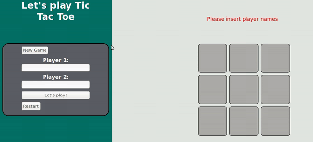

<!--
*** Thanks for checking out this README Template. If you have a suggestion that would
*** make this better, please fork the repo and create a pull request or simply open
*** an issue with the tag "enhancement".
*** Thanks again! Now go create something AMAZING! :D
-->

<!-- PROJECT SHIELDS -->
<!--
*** I'm using markdown "reference style" links for readability.
*** Reference links are enclosed in brackets [ ] instead of parentheses ( ).
*** See the bottom of this document for the declaration of the reference variables
*** for contributors-url, forks-url, etc. This is an optional, concise syntax you may use.
*** https://www.markdownguide.org/basic-syntax/#reference-style-links

-->
[![Contributors][contributors-shield]][contributors-url]
[![Forks][forks-shield]][forks-url]
[![Stargazers][stars-shield]][stars-url]
[![Issues][issues-shield]][issues-url]

<!-- PROJECT LOGO -->

 

  

  <h3 align="center">Developing a Tic Tac Toe Game</h3>

  

    This project is part of the Microverse Javascript curriculum!
     
    <a href="https://SantiagoGuerra/tic-tac-toe-javascript"><strong>Explore the docs »</strong></a>
     
    <a href="https://SantiagoGuerra/tic-tac-toe-javascript/issues">Report Bug</a>
    ·
    <a href="https://SantiagoGuerra/tic-tac-toe-javascript/issues">Request Feature</a>
    ·
    <a href="#">Live Preview</a>
  

<!-- TABLE OF CONTENTS -->
## Table of Contents

- [Table of Contents](#table-of-contents)
- [About The Project](#about-the-project)
- [Live Version](#live-version)
  - [Built With](#built-with)
- [Contact](#contact)
- [Acknowledgements](#acknowledgements)

<!-- ABOUT THE PROJECT -->
## About The Project

This is the second Microverse project of Javascript Curriculum

This is also part of the Odin project curriculum [Odin Project](https://www.theodinproject.com/courses/javascript/lessons/library)

<!-- ABOUT THE PROJECT -->
## Live Version

If you want to see it you just need to have a web browser and folow this [link - Game branch](https://raw.githack.com/SantiagoGuerra/tic-tac-toe-javascript/game/index.html)

### Built With
This project was built using these technologies.
* Javascript
* HTML
* CSS
* Stickler

<!-- CONTACT -->
## Contact

[Github: @IvanDerlich](https://github.com/IvanDerlich) - a@ivanderlich.com
 
[Github: @SantiagoGuerra](https://github.com/SantiagoGuerra) - guerrasantiago19@gmail.com

Project Link: [Game branch](https://raw.githack.com/SantiagoGuerra/tic-tac-toe-javascript/game/index.html)

<!-- ACKNOWLEDGEMENTS -->
## Acknowledgements
* [Microverse](https://www.microverse.org/)
* [The Odin Project](https://www.theodinproject.com/)

<!-- MARKDOWN LINKS & IMAGES -->
<!-- https://www.markdownguide.org/basic-syntax/#reference-style-links -->
[contributors-shield]: https://img.shields.io/github/contributors/IvanDerlich/JavascriptLibrary.svg?style=flat-square
[contributors-url]: https://SantiagoGuerra/tic-tac-toe-javascript/graphs/contributors
[forks-shield]: https://img.shields.io/github/forks/IvanDerlich/JavascriptLibrary.svg?style=flat-square
[forks-url]: https://SantiagoGuerra/tic-tac-toe-javascript/network/members
[stars-shield]: https://img.shields.io/github/stars/IvanDerlich/JavascriptLibrary.svg?style=flat-square
[stars-url]: https://SantiagoGuerra/tic-tac-toe-javascript/stargazers
[issues-shield]: https://img.shields.io/github/issues/IvanDerlich/JavascriptLibrary.svg?style=flat-square
[issues-url]: https://SantiagoGuerra/tic-tac-toe-javascript/issues
[product-screenshot]: app/assets/images/screenshot.PNG
